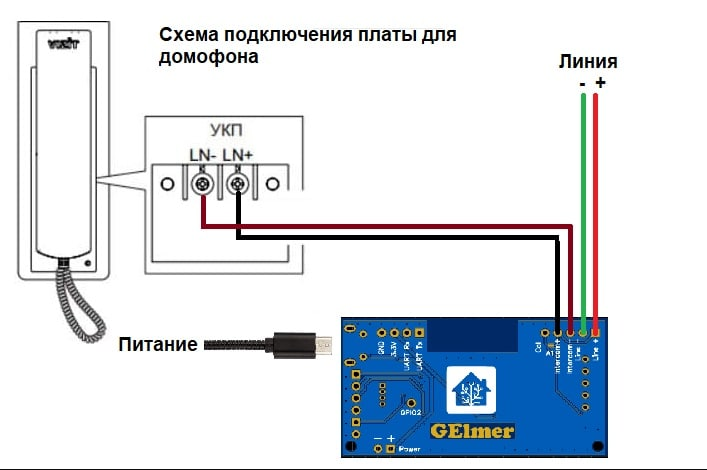

# Умный домофон (версия на [ESPHome](https://esphome.io/) от [Ge1mer](https://github.com/Ge1mer))
[English](../ge1mer/README_EN.md) | **Русский**

---

Нравится проект? [Поддержи автора](http://yasobe.ru/na/esphome)! Купи ему немного :beers: или :coffee:!

[](http://yasobe.ru/na/esphome)

---

[Схема и компоненты](https://easyeda.com/ilmir73/domofon)

[Чат в Telegram](https://t.me/domofon_esp)




## Возможности и режимы
* Управление как физической кнопкой на корпусе, так и через интеграцию с умным домом
* Режим автоматического открытия двери (одиночный и постоянный)
* Режим автоматического отклонения вызова
* Режим "без звука" постоянный или на один звонок
* Интеграция с [Home Assistant](https://www.home-assistant.io/)
* Уведомления и управление через Telegram
* Настройка яркости светодиода
* OTA обновления

## Кнопка и индикация
* Красный светодиод мигает
    * Входящий вызов
* Красный светодиод горит
    * Включен режим "отклонять всегда"
* Синий светодиод мигает
    * Подключение к WiFi или Home Assistant
* Голубой светодиод горит
    * Включен режим "без звука"
* Зеленый светодиод мигает
    * Включен режим "открыть дверь один раз"
* Зеленый светодиод горит
    * Включен режим "открывать дверь всегда"
* Одиночное нажатие кнопки
    * Нет входящего вызова - меняет режим автоматического открытия или отклонения (открыть один раз по первому нажатию, постоянное открытие по второму, отклонение по третьему)
    * Входящий звонок - откроет дверь
* Долгое нажатие кнопки
    * Нет входящего вызова - выключит режим автоматического открытия или отклонения
    * Входящий звонок - отклонит вызов

## Конфигурация и прошивка
1. Заполните настройки WiFi в файле [domofon.yaml](../ge1mer/domofon.yaml#L21)
2. Используйте [ESPHome](https://esphome.io) для компиляции и загрузки прошивки

## Уведомления в Telegram через Home Assistant

Положите [этот файл](../ge1mer/homeassistant/domofon.yaml) в `/config/packages/domofon.yaml` и исправьте используемые сервисы в автоматизации.

## Замена интеграции с Home Assistant на MQTT

1. Закомментируйте раздел API в файле [domofon.yaml](../ge1mer/domofon.yaml#L94) (строки 94-138)
2. после закомментированных строк впишите следующее:
```mqtt:
  broker: 192.168.1.25   # IP-адрес MQTT-брокера
  port: 1883             # порт MQTT-брокера
  discovery: false       # отключаем интеграцию с Home Assistant
  username: ""
  password: ""
```

## Ищем проблемы (если после подключения что-то не заработало)
1. отключите питание платы. Проверьте, работает ли домофон, как обычно.
   1. Если панель домофона на улице показывает ошибку, вероятно перепутана полярность входящих проводов, попробуйте поменять.
   2. Если вызов идёт, но в трубке нет звука, попробуйте поменять сопротивление подстроечного резистора. Для этого аккуратно поверните его отвёрткой против часовой стрелки на четверть оборота. После этого попробуйте снова. При необходимости повторите.
2.  Если с выключенной платой домофон работает как обычно, а с включенной не определяется входящий звонок (проще всего во время выхова посмотреть на строку "Domofon incoming call" в Home Assistant, необходимо увеличить в прошивке значения call_end_detect_delay и relay_answer_on_time, после чего перезалить прошивку.
3.  Если входящий звонок определяется, но не работает открытие двери через плату, необходимо увеличить в прошивке значение relay_open_on_time, после чего перезалить прошивку.
4.  если указанные действия ни к чему не привели - стоит обратиться за помощью в [чат в Telegram](https://t.me/domofon_esp).
