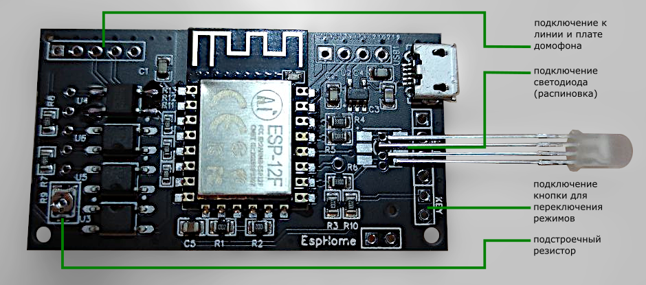

# Умный домофон (версия на [ESPHome](https://esphome.io/) от [Ge1mer](https://github.com/Ge1mer))
[English](../ge1mer/README_EN.md) | **Русский**

---

Нравится проект? [Поддержи автора](https://yoomoney.ru/to/410019180291197)! Купи ему немного :beers: или :coffee:!

---

[Схема и компоненты](https://easyeda.com/ilmir73/domofon)

[Чат в Telegram](https://t.me/domofon_esp)

[Бот в Telegram, который умеет генерировать прошивку для платы домофона](https://t.me/ESPDomofonBot)

## Монтаж в разрыв линии 
Рекомендуется подключать в базе трубки, разъединив линию в квартиру.   
Ввод линии подключается к Line -/+ на плате ge1mer, где + обычно красный. Полярность обычно можно подсмотреть на плате домофона.  
Некорректная полярность не приведет к повреждениям, но работать не будет,  
На уличной панели при вызове будет отображаться error, в целом работа домофонной системы не будет нарушена.  
Вывод — intercomm (УКП).

на этой схеме:

* УКП (устройство квартирное переговорное) — плата домофона
* Линия — входящий в квартиру кабель
* Питание — питание для платы

## Возможности и режимы
* Управление как физической кнопкой на корпусе, так и через интеграцию с умным домом
* Режим автоматического открытия двери (одиночный и постоянный)
* Режим автоматического отклонения вызова
* Режим "без звука" постоянный или на один звонок
* Интеграция с [Home Assistant](https://www.home-assistant.io/)
* Уведомления и управление через Telegram
* Настройка яркости светодиода
* OTA обновления

## Кнопка и индикация
* Красный светодиод мигает
    * Входящий вызов
* Красный светодиод горит
    * Включен режим "отклонять всегда"
* Синий светодиод мигает
    * Подключение к WiFi или Home Assistant
* Голубой светодиод горит
    * Включен режим "без звука"
* Голубой светодиод мигает
    * Включен режим "без звука один раз"
* Зеленый светодиод мигает
    * Включен режим "открыть дверь один раз"
* Зеленый светодиод горит
    * Включен режим "открывать дверь всегда"
* Одиночное нажатие кнопки
    * Нет входящего вызова - меняет режим автоматического открытия или отклонения (открыть один раз по первому нажатию, постоянное открытие по второму, отклонение по третьему)
    * Входящий звонок - откроет дверь
* Двойное нажатие кнопки
    * Если нет входящего звонка, меняет режимы "без звука" и "без звука один раз"
* Долгое нажатие кнопки
    * Нет входящего вызова - выключит режим автоматического открытия или отклонения и режимы "без звука"
    * Входящий звонок - отклонит вызов
* 8 нажатий кнопки - сброс настроек сети

## Настраиваемые параметры
* `Delay Before Answer` - время, которое пройдет между обнаружением вызова и эмуляцией поднятия трубки (в режиме автоматического открытия), по-умолчанию 400 мс
* `Answer On Time` - сколько времени пройдет в режиме эмуляции поднятой трубки перед открытием двери, по-умолчанию 1000 мс
* `Open On Time` - время, которое будет эмулироваться нажатие кнопки открытия, по-умолчанию 300 мс
* `Delay After Open` - сколько времени пройдет в режиме эмуляции поднятой трубки после нажатия кнопки открытия и перед сбросом звонка, по умолчанию 500 мс

## Подключение
1. Аккуратно вскройте домофон и определите, где кабель, входящий из подъезда, подсоединён к плате. Запомните, какой из проводов кабеля плюс, какой минус, в дальнейшем это поможет избежать ошибок подключения (впрочем, если вы их перепутаете, ничего страшного не случится, ни плата, ни домофон не пострадают, просто не будут работать, пока не подключите правильно).
2. Проверьте, нет ли на входящем из подъезда кабеле [винтовых соединений или скруток](../ge1mer/assets/domofon-line.jpg). В большинстве случаев этот кабель не припаян непосредственно к плате домофона, а подсоединён в соединительным проводам. Возможно, имеет смысл поставить плату именно в этот разрыв.
3. Подключите входящий из подъезда кабель к разъёмам Line+ и Line- платы (обратите внимание на подписи [на обратной стороне платы](../ge1mer/assets/domofon-back.jpg)), подключите идущие к плате домофона провода к разъёмам Intercom+ и Intercom- платы.
4. Подключите питание. Это возможно как через имеющийся usb-разъём, так и через разъёмы power+/power- (см. подписи [на обратной стороне платы](../ge1mer/assets/domofon-back.jpg)). Подать можно от 3.5 до 16 вольт, но надо помнить, что при напряжении более 5 вольт плата будет греться.

дополнение: чтобы упростить монтаж, можно припаять к плате винтовые клеммники (например, [такие](https://www.chipdip.ru/product/308-021-12-14)) и подключать входящий кабель, провода к плате домофона, провода к внешней кнопке и, при необходимости, кабель питания, уже к ним.

## Конфигурация и прошивка
1. Заполните настройки WiFi в файле [domofon.yaml](../ge1mer/domofon.yaml#L16)
2. Используйте [ESPHome](https://esphome.io) для компиляции и загрузки прошивки

## Подключение к Home Assistant

При первом включении через 1 минуту плата создает точку доступа `Domofon`.
Подключаемся к ней, используя пароль `1234567890`.
При этом, если это телефон, то он может ругаться что данная сеть не имеет подключения интернет. Нажимаем кнопку Использовать.
Далее в браузере открываем страницу по адресу `192.168.4.1`

На данной странице выбираем свою сеть WiFi вводим свой пароль и нажимаем кнопку `Save`.
После этого плата перезагружается и подключается к вашему WiFi.
Home assistant обычно обнаруживает подключение автоматически. Если не обнаружил, то можно подключить через интеграции. Пароль для интеграции `esphome`

При принятии или отклонении вызова в Home Assistant обновляется сенсор `Domofon Action`. Возможные значения:

* `none` – значение по-умолчанию
* `open_sw` – открыт программно
* `open_hw` – открыт аппаратной кнопкой
* `open_auto` – открыт автоматически
* `reject_sw` – отклонен программно
* `reject_hw` – отклонен аппаратной кнопкой
* `reject_auto` – отклонен автоматически

## Уведомления в Telegram через Home Assistant

Положите [этот файл](../ge1mer/homeassistant/domofon.yaml) в `/config/packages/domofon.yaml` и исправьте используемые сервисы в автоматизации.

## Замена интеграции с Home Assistant на MQTT

1. Закомментируйте раздел API в файле [domofon.yaml](../ge1mer/domofon.yaml#L41)
2. Раскомментируйте раздел MQTT в файле [domofon.yaml](../ge1mer/domofon.yaml#L42)
3. Заполните настройки MQTT в файле [domofon.yaml](../ge1mer/domofon.yaml#L21)

## Интеграция умного домофона со SprutHub

1. Замените интеграцию с Home Assistant на MQTT, как описано в предыдущем разделе. В качестве IP-адреса MQTT-брокера используйте IP-адрес SprutHub-а, порт 44444, логин и пароль оставьте пустыми.
2. Добавьте файл [domofon.json](../ge1mer/domofon.json) в каталог `/home/makesimple/.SprutHub/data/Templates/MQTT/Custom`
3. Следуйте указаниям статьи [Настройка Sprut.Hub для работы с ESP через MQTT](https://wiki.sprut.ai/ru/spruthub/accessory/mqtt-devices-templates).

## Интеграция в MajorDoMo

[Подробная инструкция](https://connect.smartliving.ru/profile/4398/blog/integraciya-majordomo-s-umnym-adapterom-dlya-domofonov-ot-espdomofonru.html)

## Ищем проблемы (если после подключения что-то не заработало)
1. Отключите питание платы. Проверьте, работает ли домофон, как обычно.
   1. Если панель домофона на улице показывает ошибку, вероятно перепутана полярность входящих проводов, попробуйте поменять.
   2. Если вызов идёт, но в трубке нет звука, попробуйте поменять сопротивление подстроечного резистора. Для этого аккуратно поверните его отвёрткой против часовой стрелки на четверть оборота. После этого попробуйте снова. При необходимости повторите.
2.  Если с выключенной платой домофон работает как обычно, а с включенной не определяется входящий звонок (проще всего во время вызова посмотреть на строку "Domofon incoming call" в Home Assistant, необходимо увеличить в прошивке значения call_end_detect_delay, после чего перезалить прошивку.
3.  Если входящий звонок определяется, но не работает открытие двери через плату, необходимо увеличить значение "Open On Time" в HA или веб-интерфейсе платы.
4.  Если указанные действия ни к чему не привели - стоит обратиться за помощью в [чат в Telegram](https://t.me/domofon_esp).
